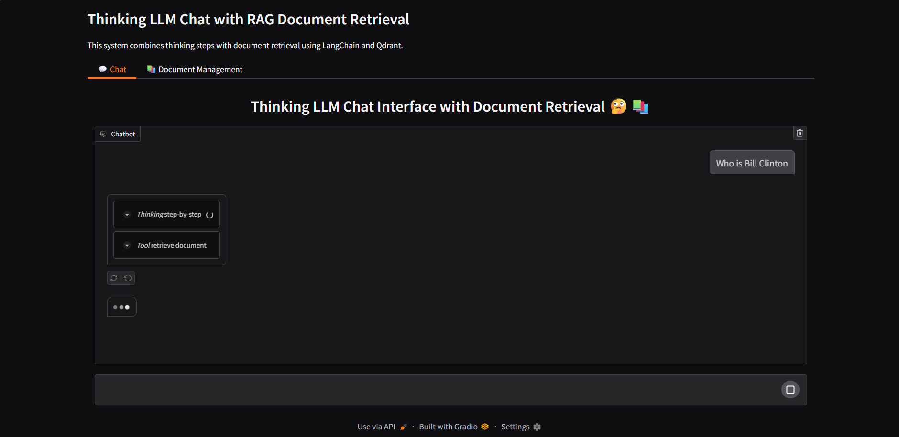

# RAG Chat with Thinking

This is a RAG (Retrieval-Augmented Generation) chat application that combines document retrieval with thinking steps using LangChain, Qdrant, and Ollama. The application uses advanced language models to provide thoughtful, context-aware responses.

## Features

- Document retrieval and context-aware responses
- Thinking steps visualization
- Vector storage with Qdrant
- Local LLM support with Ollama
- Modern web interface with Gradio

## Application Interface

### Document Upload

*Upload your documents to start chatting with context-aware responses*

### Chat Interface

*Interactive chat interface with document context*


*Detailed responses with thinking steps visualization*

## Prerequisites

- Docker
- Docker Compose
- At least 8GB of RAM (for running LLMs)
- 10GB of free disk space

## Setup and Running

1. Clone the repository:
   ```bash
   git clone <repository-url>
   cd rag
   ```

2. Start the services:
   ```bash
   docker-compose up -d
   ```

   This will automatically:
   - Start Qdrant vector database
   - Launch Ollama with required models (nomic-embed-text and qwen3:8b)
   - Deploy the RAG chat application

3. Access the application:
   - Web Interface: http://localhost:7860
   - Ollama API: http://localhost:11434
   - Qdrant API: http://localhost:6333
   - Qdrant Dashboard: http://localhost:6334

## Services

- **RAG Chat App**: The main application running on port 7860
  - Built with Gradio for the web interface
  - Integrates with Ollama and Qdrant
  - Provides document retrieval and chat functionality

- **Ollama**: Running on port 11434
  - Manages local LLM models
  - Pre-configured with nomic-embed-text and qwen3:8b models
  - Handles text generation and embeddings

- **Qdrant**: Running on ports 6333 (API) and 6334 (Dashboard)
  - Vector database for document storage and retrieval
  - Provides efficient similarity search
  - Includes a web dashboard for monitoring

## Stopping the Services

To stop all services:
```bash
docker-compose down
```

To stop and remove volumes (this will delete all data):
```bash
docker-compose down -v
```

## Troubleshooting

1. If models fail to pull, check Ollama logs:
   ```bash
   docker-compose logs ollama
   ```

2. If the application fails to start, check app logs:
   ```bash
   docker-compose logs rag-app
   ```

3. If Qdrant fails to start, check Qdrant logs:
   ```bash
   docker-compose logs qdrant
   ```

4. If you encounter memory issues:
   - Ensure your system has at least 8GB of RAM
   - Consider using a smaller model by modifying the ollama-entrypoint.sh script

## Development

The project structure includes:
- `rag_chat_app/`: Main application code
- `scripts/`: Utility scripts including Ollama setup
- `Dockerfile`: Application container configuration
- `docker-compose.yml`: Service orchestration
- `requirements.txt`: Python dependencies
- `pyproject.toml`: Project metadata and build configuration 